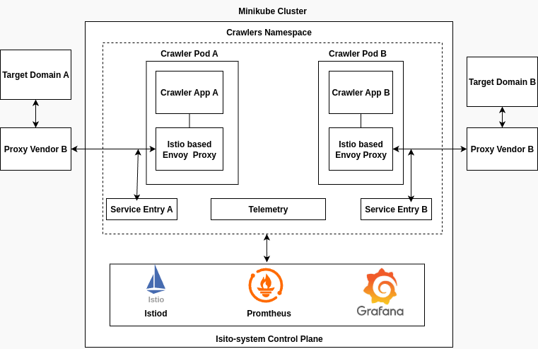

# Architecture



## Installation

1. Start Minikube

```bash
minikube start --driver=docker
```

2. Install Istio in the cluster

```bash
istioctl install --set profile=minimal -y

kubectl get pods -n istio-system
```
3. Install Prometheus and Grafana

```bash
kubectl apply -f https://raw.githubusercontent.com/istio/istio/release-1.26/samples/addons/prometheus.yaml
kubectl apply -f https://raw.githubusercontent.com/istio/istio/release-1.26/samples/addons/grafana.yaml
```
4. Apply Kubernetes Manifests

```bash
kubectl apply -f manifests/
```

4. Port Forwarding

```bash
kubectl port-forward svc/prometheus 9090:9090 -n monitoring
kubectl port-forward svc/grafana 3000:3000 -n monitoring
```
## Monitoring

1. HTTP based Prometheus Queries

```bash
sum by (vendor_header, pod, namespace, destination_service) (
  istio_requests_total
)

sum by (vendor_header, pod, namespace, destination_service) (
  istio_request_bytes_sum
)

sum by (vendor_header, pod, namespace, destination_service) (
  istio_response_bytes_sum
)

```

2. HTTPS based Prometheus Queries

```bash
sum by (pod, namespace, destination_service) (
  istio_tcp_connections_opened_total
)

sum by (pod, namespace, destination_service) (
  istio_tcp_sent_bytes_total
)

sum by (vendor_header, pod, namespace, destination_service) (
  istio_tcp_received_bytes_total
)
```

